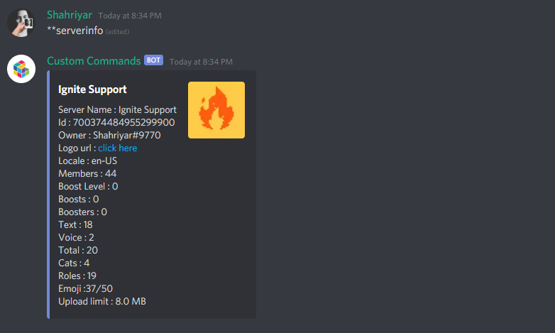

[](https://discord.com/oauth2/authorize?client_id=724847752449753140&permissions=268815424&scope=bot)

## Information
Some information need to know before inviting the bot. 

- Any member can make commands. But they will be unapproved. An admin or server manager must approve the commands to be used. See how to approve a command [Here](?id=management)
- If a command gets edited, the command will become unapproved regardles if approved in the past unless the editor has the `Manage server` permission.
- If a command is unapproved server managers can still execute that command to see command content to decide wheather it should be approved or not.
- If a member has the `Manage Server` permission command made will be approved automatically after creation.
- If you are administrator you can delete any command made by anyone. But if you don't have the `Administrator` permission you can't delete other's command untill you own that command. 
- Server managers can unapprove any command including their own and other's commands.
- A command can have multiple aliases. 
- Deleting main command will delete aliases too. But deleting an alias will delete main command.

Give the `Server Manager` permission to trusted people.

> Why restricted?

There are some people who will missuse this bot to make command with pornographic content or bad words etc. Thats why command making is restricted and requires approval.

## Available type of commands
All the syntax and examples is documented assuming prefix is `**`
### Embed
Send an embed when command is executed

`Syntax` \**embed \<command_name>

After doing this you will be asked few questions
> 1. What will be the embed **title**?
> 2. Your embed **description**
> 3. **Thumbnail** image url
> 4. **Image** url

If you are not sure what those are, [See this](?id=embed-components)

> Editing embed

`Syntax ` **edit embed \<command_name> \<component> \<new_value>

`Example` \**edit embed myfirstembed `title` This is a new awesome title.
> In place of title you can put what component you want to edit and the editted content

#### Embed components
> This image shows embed components


### Text
Send a normal text.

`Syntax ` \**text \<command_name> \<content>

`Example ` \**text myfirsttext This is a text response

> Editing an text command

`Syntax ` \**edit text \<command_name> \<new_content>

### Role
There are 3 type of role commands

1. giverole
2. removerole
3. togglerole

`Syntax ` \**\<role_command_type> \<command_name> \<role>
> In place of **\<role_command_type>** you can put any of the 3 types

`Example ` \*\*giverole dev @Developers

> When someone executes this command, they will get the Developers role.

**Note:** If after making the a role command and the role is deleted, either remake or edit the command to keep it valid.

> Editing a role command

`Syntax ` \*\*edit role \<command_name> \<role>

This will change the role of a role command.

**Note:** The bot's role or the bot's highest role must be higher than the role being used in commands. 

## Other usefull features
### Poll
Make poll in the current channel

`Syntax` \**poll "\<question>" choice1,choice2,choice3,choice4

In place of \<question> put your question. Remeber to put " " In both side of question. (Double quotes)

`Example ` \**poll "How is the day?" Cool, Bad, Average

### Vote
Make vote in the current channel. The difference between polls and votes is that a duration can be set for votes and the majority option is shown when the vote ends

`Syntax ` \**vote "\<question>" \<duration> choice1,choice2,choice3,choice4

In place of \<question> put your question. Remeber to put " " In both side of question. (Double quotes). And \<duration> is the amount of seconds it will wait before publishing result

`Example ` \**vote "Who should be a co-owner?" 60 Ali, Joe, Chr1s

There is a minimum of 2 choices and a maximum of 4 choices for the Poll and Vote command.

# Management
Commands list, delete and see help

\*\*delete \<command_name> - Will delete a command/alias\
\*\*list - Will show list of commands made on this server\
\*\*list unapproved - Show a list of unapproved commands on this server
> Unapproved commands are those commands made by normal server members who don't have `Manage server` permission. An Admin or server manager need to approve the command made by normal members before they can be used. How to approve or unapprove a command is explained below

\*\*approve \<command_name> - To approve a command\
\*\*unapprove \<command_name> - To unapprove a command

## Aliasing a command
`Syntax` \*\*alias \<command_name> \<alias>\
`Example` \*\*alias serverinfo si\
> `serverinfo` command now aliased to `si`. And `**serverinfo` and `**si` will be same now. Deleting an alias is same as deleting a command.

## Editing command
You can also edit command name, custom help for command and command owner.

> Editing command name

`Syntax` \*\*edit command name \<command_previous_name> \<new_name>


> Editing command custom help

`Syntax` \*\*edit command help \<command_name> Your help text


> Changing command owner

`Syntax` \*\*edit command owner \<command_name> \<new_owner>

**Note:** By changing owner to someone else you will loose ability to edit/delete the command.

## Aliasing command
`Syntax` \*\*alias \<command_name> \<alias>\
If you want 2 command do the same work alias the main command to another one.

`Example` \*\*alias serverinfo si\
Now `serverinfo` command has been aliases to `si`. `**si` and `**serverinfo` will do same. Any changes made on serverinfo command will be applied to all its aliases. A command can have unlimited aliases.

## Making command interactive
Introducing variables. variables can help making command interactive with dynamic content that updates automatically.

`{user}` - Will mention the command author\
`{user_id}` - Message author id\
`{user_avatar}` - Message author avatar url\
`{server}` - server name.\
`{server_owner}` - server owner name.\
`{server_id}` - server id.\
`{server_logo}` - server logo url.\
`{server_locale}` - Server current locale.\
`{members}` - Server member count.\
`{level}` - Server boost level.\
`{boosts}` - Server boost count.\
`{boosters}` - Server booster count.\
`{text_channels}` - Server text channels count.\
`{voice_channels}` - Server voice channels count.\
`{total_channels}` - Server all channel count.\
`{categories}` - Server category count.\
`{roles}` - Server role count.\
`{level}` - Server boost level\
`{emojis}` - Server emoji count.\
`{emoji_limit}` - Server maximum emoji limit.\
`{filesize_limit}` - Server maximum file upload limit (MB).

## Custom variable
> To make own custom variable\
**variable add \<name> \<value>

> Edit existing custom variable\
**variable add \<name> \<value>\


> View value of a custom variable\
**variable view \<name>\


> List of all custom variable\
**variable list\


> Delete a custom variable\
**variable remove \<name>\

`Note : ` Making a variable already available in pre defined variables will override that.

> An example of dynamic custom command using variables.
- Make a embed command named `serverinfo`. (\*\*embed serverinfo)
- When it asks for title type `{server}`
- And when asked for description type the text below. 
- You can add thumbnail (optional). or just type pass
```
Server Name : {server}
Id : {server_id}
Owner : {server_owner}
Logo url : [click here]({server_logo})
Locale : {server_locale}
Members : {members}
Boost Level : {level}
Boosts : {boosts}
Boosters : {boosters}
Text : {text_channels}
Voice : {voice_channels}
Total : {total_channels}
Cats : {categories}
Roles : {roles}
Emoji :{emojis}/{emoji_limit}
Upload limit : {filesize_limit}
```

> Running your commannd



# Customization
Some simple customization

## Change prefix
`Syntax` \*\*prefix \<new_prefix>\
`Example` \*\*prefix +
> The server prefix will be `+`

## Cool feature
NoPrefix™️
`**noprefix toggle` Toggles NoPrefix feature on/off
When on, executing commands won't require the prefix infront of the message.
`Example` Command `test` | Sending just `test` will execute the command.
You can still use commands with the prefix while NoPrefix is on.

Reviewed and editited by Ali
